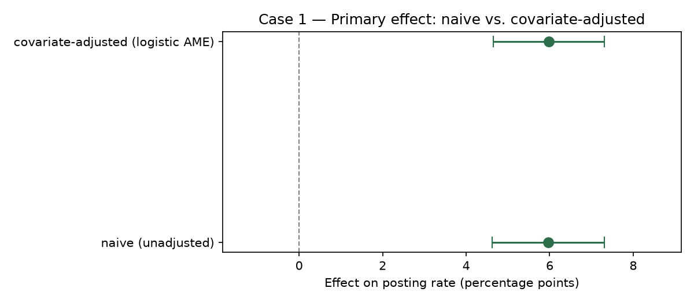
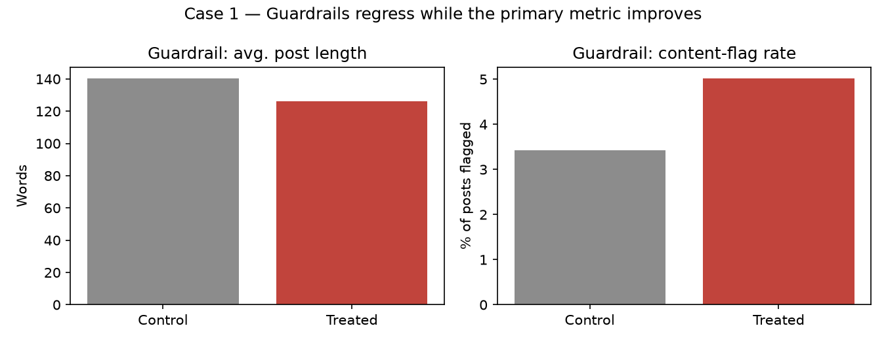
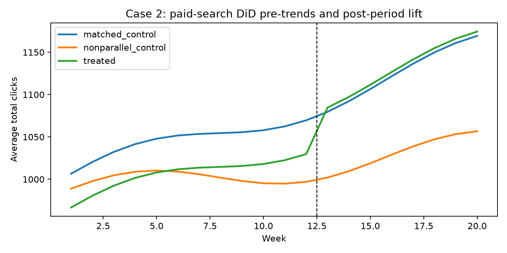
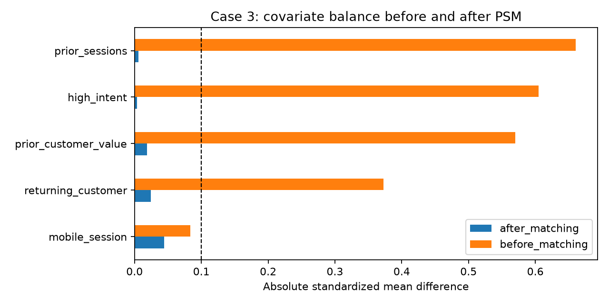

# Experimentation & Causal Impact Casebook

**A/B testing and causal inference casebook for business decisions where the naive read is wrong.**
Check randomization → test the causal assumption → estimate the effect → make the decision.


---

## The Headline

Three common product and marketing reads look convincing at first glance:

- A posting nudge lifts engagement by about **+6.0 percentage points**.
- Paid-search clicks appear to return **320.0%** revenue per dollar of spend.
- Directed-search sessions show **$15.09** more sales than other sessions.

Each topline number misses the decision risk. The A/B test has regressing guardrails, the paid-search ROI counts cannibalized organic clicks as incremental, and the directed-search read is inflated by self-selection. The corrected methods change the recommendation.

| Case | Question | Topline read | Decision-grade read | Decision |
|---|---|---:|---:|---|
| A/B test readout | Should a posting nudge roll out to all users? | `+5.97pp` posting lift | `+5.98pp`, but post length `-10.2%` and flag rate `+1.6pp` | Do not ship as-is |
| Difference-in-differences | Should paid search scale from observed paid-click ROI? | `320.0%` ROI | `80.0%` DiD ROI, `45.0` incremental clicks | Use corrected ROI hurdle |
| Propensity score matching | Does directed search increase session sales? | `$15.09` lift | `$7.91` matched ATT vs. `$8.00` planted effect | Credit only matched lift |



---

## Figures

The A/B case shows why a primary-metric win can still fail a launch decision.



The paid-search case uses pre-period trend diagnostics before trusting the DiD comparison group.



The directed-search case shows balance improving after propensity-score matching.



---

## How To Run

```bash
make setup      # creates a Python environment and installs pinned requirements
make notebooks  # executes every case notebook in place
make test       # ruff runs in CI; pytest validates the toolkit locally
```

For a fresh environment outside the repo:

```bash
make setup VENV=/tmp/eci-venv PYTHON_BOOTSTRAP=/opt/miniconda3/bin/python3
make notebooks VENV=/tmp/eci-venv
make test VENV=/tmp/eci-venv
```

---

## Toolkit

```
src/causal_toolkit/ab.py       A/B test generator, SRM check, power, effect + CI, guardrails
src/causal_toolkit/did.py      panel generator, pre-trend check, DiD estimate, ROI translation
src/causal_toolkit/psm.py      session generator, propensity scores, nearest-neighbor ATT
src/causal_toolkit/balance.py  standardized mean differences and SRM chi-square utility
sql/                           DuckDB metric mirrors for the case readouts
tests/                         known-answer tests against planted effects
```

The tests intentionally check that the methods recover planted effects:

- A/B readout recovers the seeded posting-rate lift and catches sample-ratio mismatch behavior.
- DiD recovers the planted `45.0` incremental clicks and rejects the non-parallel broad control group.
- PSM pulls the self-selected `$15.09` naive gap back to the planted `$8.00` effect and improves balance.

---

## Data Note

All data is synthetic, seeded, and generated for this public portfolio repo. The motivating source datasets were not redistributed because their license status is unclear. No source documents, source rows, classroom labels, instructor names, customer records, or real company data are included.

Committed data files are small synthetic case outputs used for repeatable demos and SQL checks. Every result in the memos comes from code in the repo, not hand-entered spreadsheet math.

---

## Repository Layout

```
cases/      one-page memos and executable notebooks/scripts
data/       small seeded synthetic outputs
reports/    generated figures
sql/        DuckDB cross-checks for reported metrics
src/        reusable causal-inference toolkit
tests/      pytest known-answer and diagnostics tests
```

**Stack:** Python 3.13 · pandas · NumPy · statsmodels · SciPy · Matplotlib · DuckDB · Jupyter · pytest · ruff · GitHub Actions

---

## Limitations

- Synthetic data makes the ground truth testable, but it is not evidence that the exact effect sizes would appear in production data.
- DiD depends on a credible parallel-trends comparison group; the notebook demonstrates the screen, not a universal proof.
- PSM adjusts observed covariates only; hidden intent can still bias real-world estimates.
- The launch recommendations are portfolio demonstrations, not production policy.

## License

MIT

Part of a six-project data analytics portfolio — see [github.com/KyleZ8](https://github.com/KyleZ8)
